<!-- Coverbild oben in der README -->
<p align="center">
  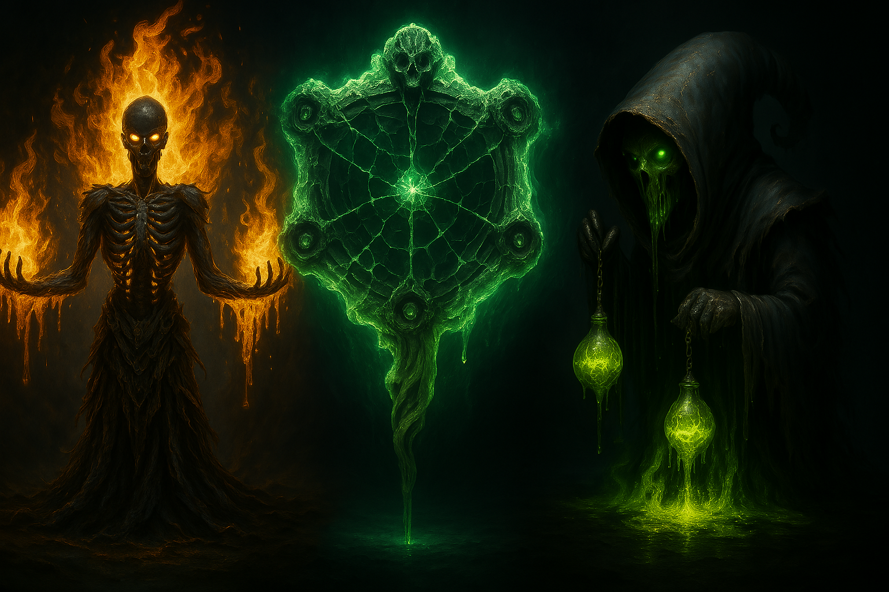
</p>

<hr style="border: 2px solid #FF6600;">

# Dark Snake Game 🐍🔥

**Willkommen zum Dark Snake Game – dem ultimativen Snake-Erlebnis mit Bosskämpfen, magischen Portalen, witzigen AOE-Effekten und einer modernen, modularen Architektur.**  
_Tauche ein in ein Spielerlebnis, das so einzigartig ist wie dein Humor – düster, schnell und voller Überraschungen!_

---

## Inhaltsverzeichnis

- [Über das Spiel](#über-das-spiel)
- [Features im Überblick](#features-im-überblick)
- [Screenshots & Spielaufnahmen](#screenshots--spielaufnahmen)
  - [Standardaufnahmen](#standardaufnahmen)
  - [Weitere Spielaufnahmen (GamePICs)](#weitere-spielaufnahmen-gamepics)
- [Installation und Ausführung](#installation-und-ausführung)
- [Modulare Architektur](#modulare-architektur)
  - [Konfiguration (config.py)](#konfiguration-configpy)
  - [Main-Startpunkt (main.py)](#main-startpunkt-mainpy)
  - [AOE-Zonen (aoe_zones.py)](#aoe-zonen-aoe_zonespy)
  - [Audio (audio.py)](#audio-audiopy)
  - [Steuerung (controls.py)](#steuerung-controlspy)
  - [Anpassungs-Menü (customization.py)](#anpassungs-menü-customizationpy)
  - [Gegner (enemies.py)](#gegner-enemiespy)
  - [Aufzählungen (enums.py)](#aufzählungen-enumspy)
  - [Spiel-Logik (game.py)](#spiel-logik-gamepy)
  - [Options-Menü (options_menu.py)](#options-menü-options_menupy)
- [Bereitstellung des Quellcodes als ZIP](#bereitstellung-des-quellcodes-als-zip)
- [Lizenz](#lizenz)
- [Kontakt & Feedback](#kontakt--feedback)

---

## Über das Spiel

**Dark Snake Game** kombiniert den klassischen Spielspaß von Snake mit modernen Herausforderungen. Steuere deine Schlange durch dynamische Level, sammle Power-Ups, besiege furchteinflößende Bosse und nutze überraschende Spezialeffekte wie Portale und AOE-Zonen – und das alles in einem visuell und akustisch ansprechenden Dark-Art-Stil!

> **Hinweis:** Dieses Projekt wurde als reines Hobby entwickelt. Trotz chronischer MS und unermüdlichem Einsatz – über Wochen habe ich allein daran gefeilt – steht hier ein Ergebnis, das ohne meinen unerschütterlichen Einsatz niemals so weit gekommen wäre. Danke auch an die beeindruckende KI, die mir unter die Arme gegriffen hat. Ohne diese Kombination aus Leidenschaft und Technologie wäre dieses Open-Source-Projekt nicht denkbar! 💪❤️

---

## Features im Überblick

- **Dynamische Spielmechanik:** Klassisches Snake trifft auf innovative Bosskämpfe, Power-Ups, Portale und AOE-Effekte.
- **Individuelle Anpassungen:** Wähle verschiedene Schlangendesigns und optimiere Gameplay-Einstellungen sowie Audio über ein modernes Optionsmenü.
- **Modulare Architektur:** Sauber getrennte Module (Konfiguration, Grafik, UI, Audio, Gameplay, etc.) erleichtern Wartung und Erweiterung.
- **Visuelle & akustische Highlights:** Atemberaubende Grafiken und stimmungsvolle Soundeffekte sorgen für ein intensives Spielerlebnis.
- **Open Source:** Der komplette Quellcode ist als ZIP verfügbar – perfekt zum Mitmachen, Anpassen und Lernen.

---

## Screenshots & Spielaufnahmen

### Standardaufnahmen

#### Titelbild
<p align="center">
  
</p>

#### Options- und Profilbilder
<p align="center">
  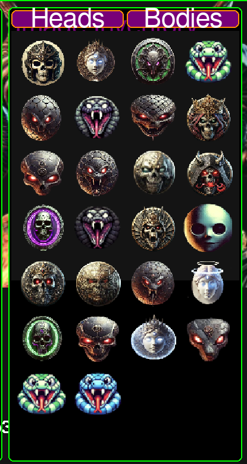
</p>

#### Steuerung
<p align="center">
  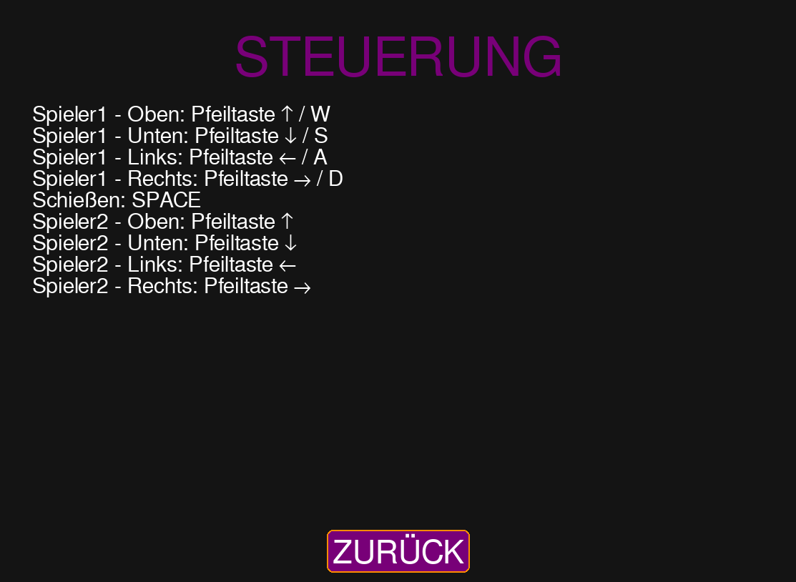
</p>

#### Spielszene
- **Spiel Szene 1:**
  <p align="center">
    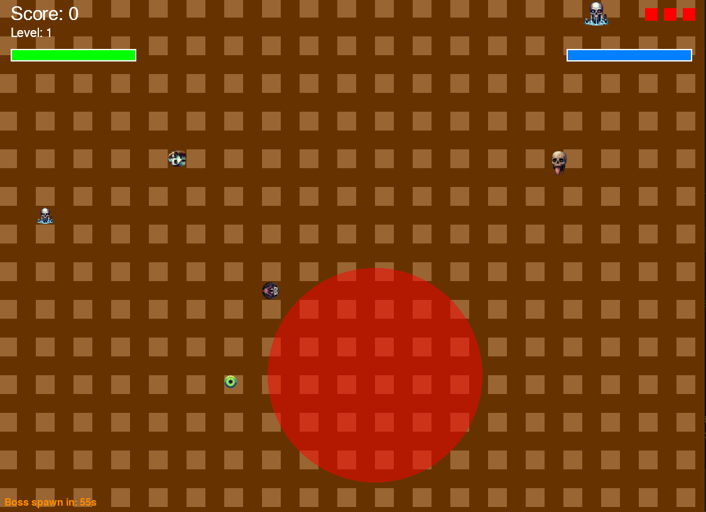
  </p>
  
- **Boss Fight 1:**
  <p align="center">
    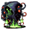
  </p>
  
- **Portal Event:**
  <p align="center">
    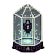
  </p>
  
- **AOE Effekte:**
  <p align="center">
    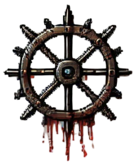
  </p>

### Weitere Spielaufnahmen (GamePICs)

Diese Bilder zeigen weitere spannende Aspekte und Designelemente des Spiels:
- **AOE-Zonen:**  
  <p align="center">
    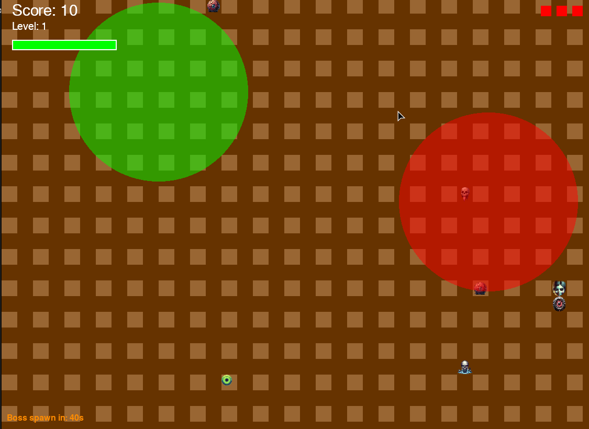
  </p>
- **Background Settings:**  
  <p align="center">
    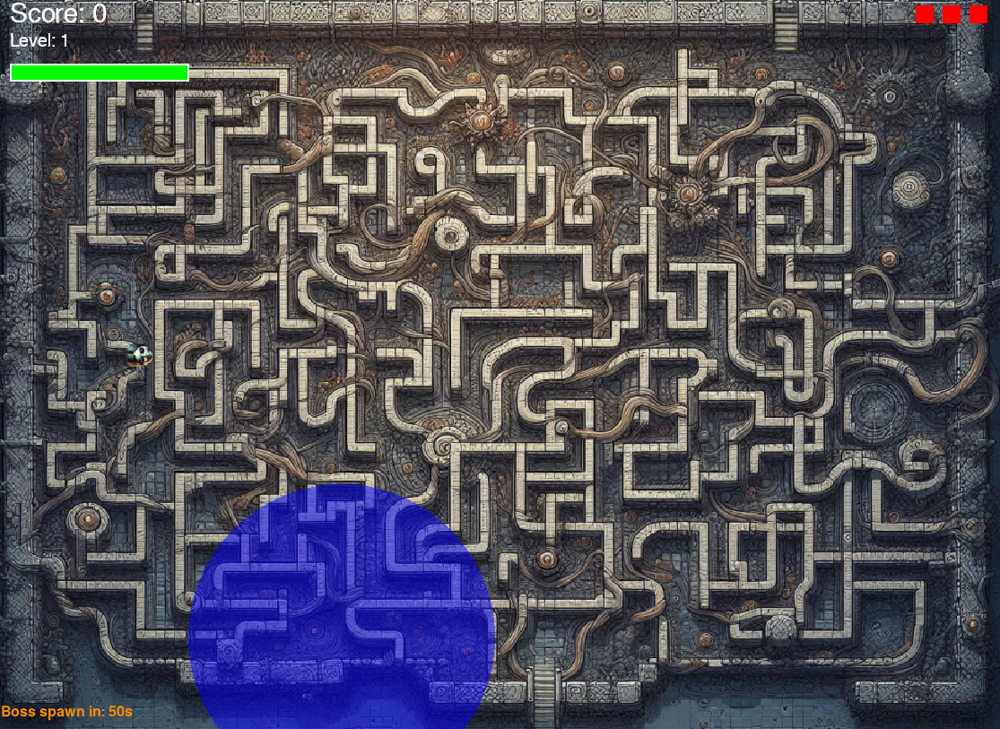
  </p>
- **Boss Game Over:**  
  <p align="center">
    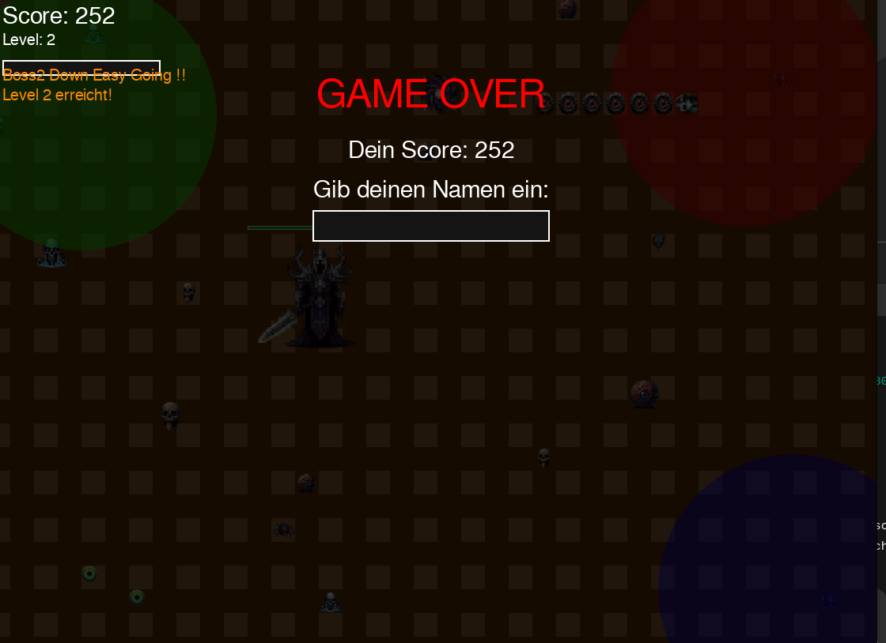
  </p>
- **LeaderBoard:**  
  <p align="center">
    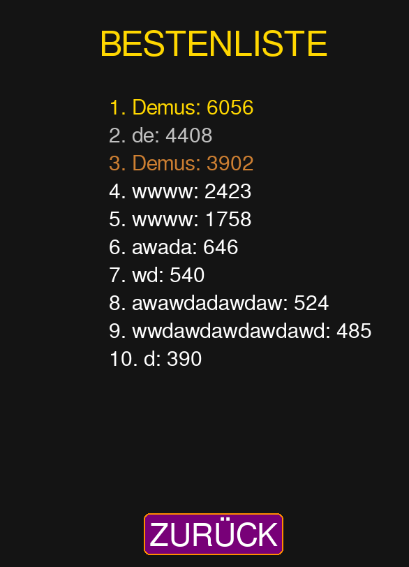
  </p>
- **Hintergrundmusik:**  
  <p align="center">
    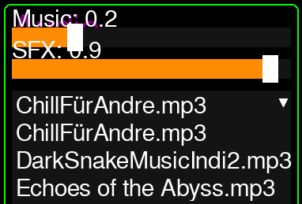
  </p>
- **Options:**  
  <p align="center">
    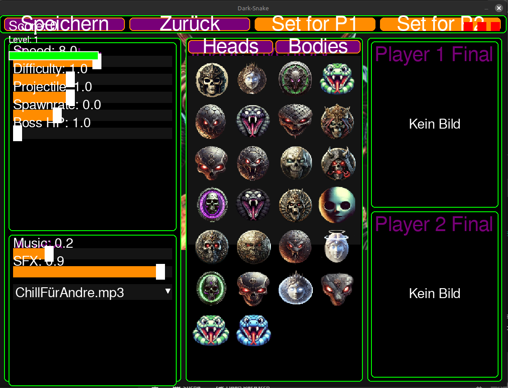
  </p>
- **Snake Bodies:**  
  <p align="center">
    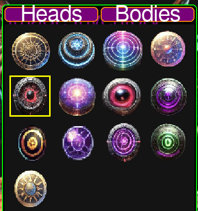
  </p>
- **Snake Heads:**  
  <p align="center">
    
  </p>
- **Start Menü:**  
  <p align="center">
    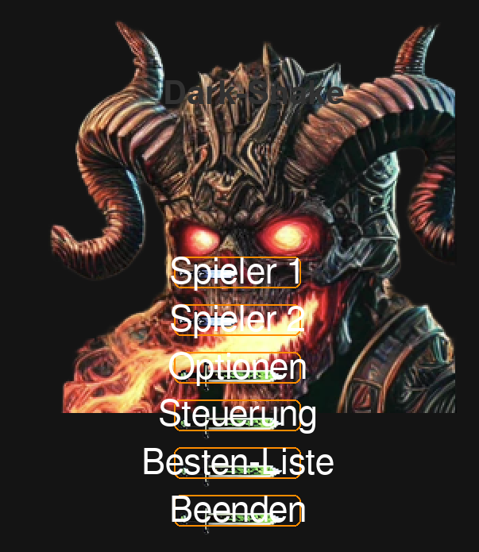
  </p>
- **Steuerung (nochmals):**  
  <p align="center">
    
  </p>
- **Two Player Modus:**  
  <p align="center">
    
  </p>

---

## Installation und Ausführung

### Voraussetzungen
- [Python 3.12](https://www.python.org/downloads/)
- [Pygame](https://www.pygame.org/news)
- Eventuelle weitere Abhängigkeiten über:
  ```bash
  pip install -r requirements.txt
