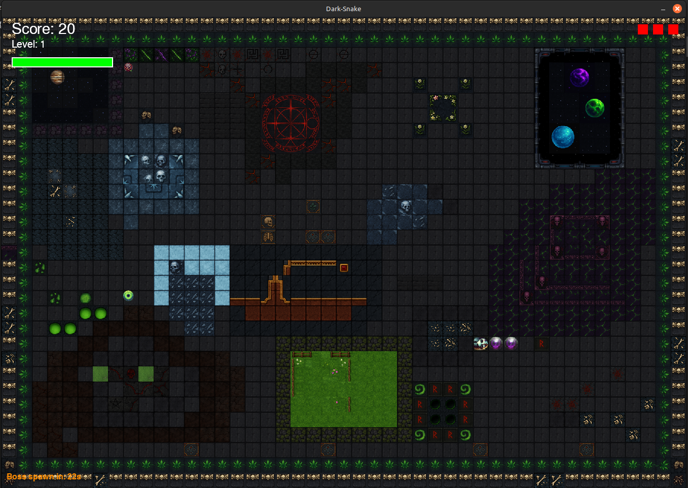
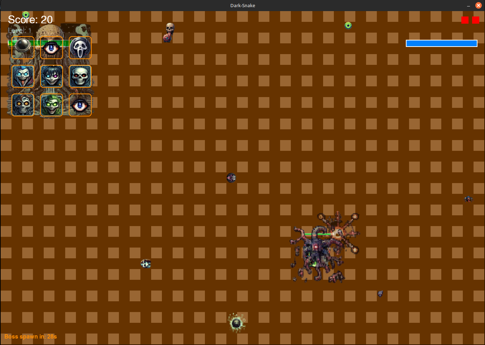

# 🐍 Dark Snake – Complete Snake Game: Dark Art Edition


*Eine düstere Snake-Reinkarnation mit Bossfights, Portalen, Effekten, Items und integriertem Leveleditor mit 500+ Tiles.*

---

## ✨ Ein visueller Einstieg in das Spiel

<p align="center">
  
</p>

*Beispiel-Level mit vollständig belegtem Editorfeld – erzeugt mit dem neuen integrierten LevelEditor.*

<p align="center">
  
</p>

<p align="center">
  
</p>

---

## 🔹 Was ist *Dark Snake*?

**Dark Snake** ist ein modular entwickeltes Indie-Snake-Spiel mit einzigartigem Grafikstil, Bossfights, automatischem Feuerschuss, Spezialprojektilen, AOE-Zonen, individuell gestaltbaren Snake-Designs – und einem vollständig integrierten, visuell gestalteten LevelEditor.

> **Hinweis von DemusOpalium:** Das Projekt entstand als Herzblutarbeit trotz MS-Erkrankung. Diese README wurde mit Hilfe von GPT4.5 erstellt, um das Projekt bestmöglich für Spieler und Entwickler zu dokumentieren.

---

## 🔺 Update-History & aktuelle Highlights (Stand: 27.04.2025)

* ✅ Neuer Bossschuss: **BossFlameProjectile** (visuell & explosiv)
* ✅ AdminPanel-Update: **Bolbu-Spawns**, **AOE-Zonen**, **Sofort-Debug-Actions**
* ✅ Editor mit über **500 Tiles** aus `assets/graphics/tiles`
* ✅ Voll funktionaler 2-Spieler-Modus
* ✅ Hintergrundmusik-System (einfach mp3/wav einwerfen)

---

## 🔸 Inhaltsverzeichnis

* [Features im Überblick](#features-im-überblick)
* [LevelEditor Highlights](#leveleditor-highlights)
* [Screenshots](#screenshots)
* [Steuerung](#steuerung)
* [Installation & Start](#installation--start)
* [Modulstruktur & Doku](#modulstruktur--doku)
* [Download, Lizenz & Kontakt](#download-lizenz--kontakt)

---

## 🌟 Features im Überblick

| Feature            | Beschreibung                                                        |
| ------------------ | ------------------------------------------------------------------- |
| 🧠 KI-Gegner       | Gegner mit Spawnverhalten, Health, Projektile                       |
| 🔥 FireProjectile  | Spieler-Feuerball mit Explosionseffekt bei Aufprall                 |
| 🌌 AOE-Zonen       | Damage / Heal / Slow / Buff-Aura / Hintergrundbild                  |
| 🐉 Boss-System     | Flammenangriffe, Spezialeffekte, Animation, AoE                     |
| 🎨 Editor          | 500+ Tiles, Favoriten, Drag2Draw, Simulation (F2)                   |
| 🛠️ Adminpanel     | Spawn von Items, Feinden, AOE-Zonen, Effekte (TAB)                  |
| 👥 2-Spieler-Modus | Geteilte Healthbars, getrennte Steuerung & Designs                  |
| 🎵 Musikplayer     | Eigene Musikdateien auswählbar im Optionen-Menü (dauerhaft loopbar) |
| 🎭 Anpassung       | Spieler-Kopf- und Körpergrafiken über Inventarsystem auswählbar     |

---

## 🔧 LevelEditor Highlights

* 🌠 **500+ Tiles** im dunklen Stil (Galaxie, Altar, Hanf, Lava, Frost, Venom u.v.m.)
* 🔄 Favoriten, Undo/Redo, Karten speichern und sofort starten
* ☑️ Mitgelieferte Beispiele in `assets/levels/`
* ⚖️ Aufrufbar im Spiel per Taste **F2** – nahtlos zwischen Menü und Simulation

---

## 🌄 Screenshots

### Spielszene mit AOE-Zonen und Items

<p align="center">
  
</p>

### Optionen / Snake-Designs

<p align="center">
  
  
</p>

### AdminPanel & Effekte

<p align="center">
  
  
</p>

### Musik- und Hintergrundoptionen

<p align="center">
  
  
</p>

### Portal, Boss, Leaderboard

<p align="center">
  
  
</p>

---

## ⌨ Steuerung

| Taste           | Funktion                              |
| --------------- | ------------------------------------- |
| **WASD**        | Bewegung Spieler 1                    |
| **Pfeile**      | Bewegung Spieler 2                    |
| **Space / +**   | Feuerball Spieler 1/2                 |
| **TAB**         | Admin-Panel öffnen                    |
| **F2**          | Editor starten                        |
| **Ü**           | Spezial-Hintergrund-Effekt aktivieren |
| **R/T/Z/U/I/O** | AOE-Zonen auslösen (Debug/Test)       |
| **ESC**         | Zurück ins Hauptmenü                  |

---

## 📁 Installation & Start

```bash
pip install pygame
python main.py
```

Falls Probleme: Terminal öffnen und direkt mit `python3 main.py` starten

---

## 📚 Modulstruktur & Doku

* **Modulstruktur –** [DEV\_STRUCTURE.md](DEV_STRUCTURE.md)
* **Screenshots & Galerie –** [GALLERY.md](GALLERY.md)
* **Steuerung im Detail –** [CONTROLS.md](CONTROLS.md)
* **GPT Prompt-Guide –** [PROMPT\_GUIDE.md](PROMPT_GUIDE.md)
* **Roadmap & ToDo-Liste –** [ROADMAP.md](ROADMAP.md)

---

## 📤 Download, Lizenz & Kontakt

* Projektlizenz: **MIT License**
* Repo: [github.com/DemusOpalium/dark-snake-game](https://github.com/DemusOpalium/dark-snake-game)
* Quellcode: ZIP-Download oder Klonen via Git

> Entwickelt mit ❤️, Python, GPT4.5 und unermüdlichem Willen.
> Dieses Projekt ist mehr als ein Spiel: Es ist ein sichtbarer Beweis für kreative Kraft trotz Krankheit, Einschränkung und Widerstand.
